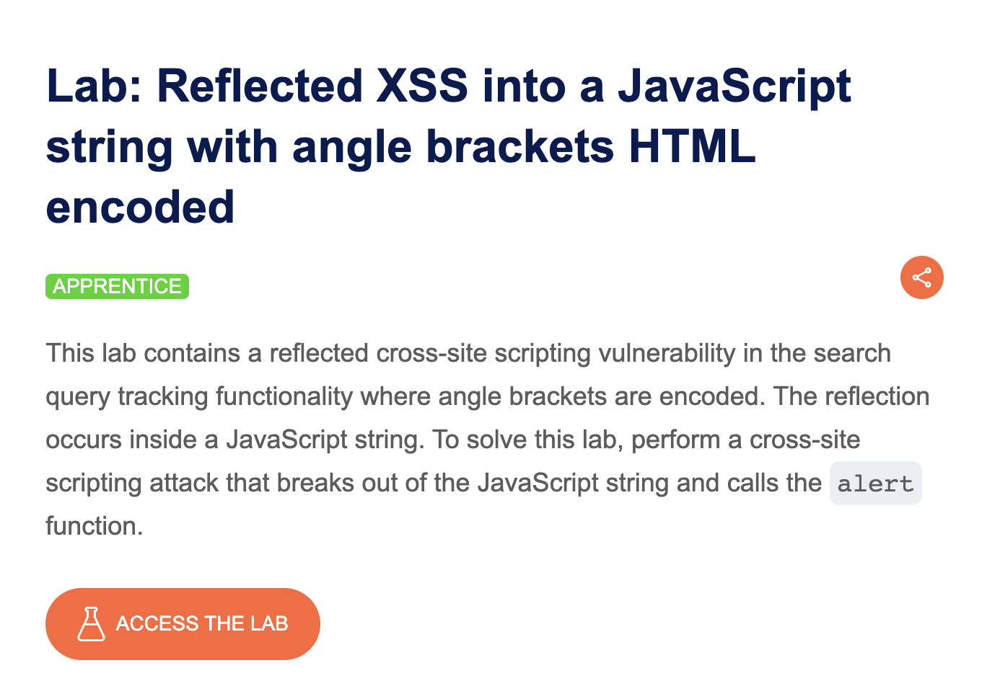
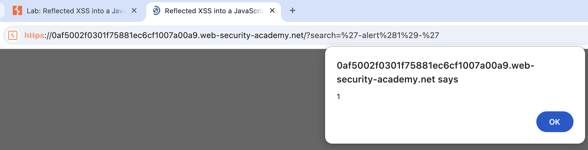

# 🔐 Reflected XSS in JavaScript String


## 📌 Overview

This project documents a web security lab demonstrating a **Reflected Cross-Site Scripting (XSS)** vulnerability where user-controlled input is reflected inside a **JavaScript string context**.

The purpose of this project is to demonstrate the process of identifying the injection point, understanding the context in which the input is reflected, testing an initial payload, analyzing why the payload does not execute, and then demonstrating successful JavaScript execution.

The project also documents the remediation and verification process.

---

## 🎯 Lab Objective

The objective of this lab was to:

* Identify where user-controlled input is reflected.
* Determine the context in which the input is inserted.
* Test a basic XSS payload.
* Understand why a standard `<script>` payload does not execute.
* Analyze the JavaScript string context.
* Demonstrate successful JavaScript execution.
* Understand the potential security impact.
* Document an appropriate remediation.
* Verify that the vulnerability has been addressed.

---

## 🧪 Vulnerability

**Vulnerability:** Reflected Cross-Site Scripting (XSS)

**Injection Context:** JavaScript string

**Category:** Client-Side Web Security

**Attack Type:** Reflected XSS

---

# 🔍 Methodology

The vulnerability was analyzed using the following process:

```text
Identify Input
      ↓
Find Reflection Point
      ↓
Determine Injection Context
      ↓
Test Basic XSS Payload
      ↓
Analyze Why It Fails
      ↓
Construct Context-Aware Payload
      ↓
Verify JavaScript Execution
      ↓
Apply Remediation
      ↓
Retest
```

---

# 1️⃣ Lab Information

The first step was to review the lab information and understand the objective of the exercise.



The lab focuses on reflected user input being inserted into a JavaScript string.

---

# 2️⃣ Lab Content

The application was inspected to identify the functionality that accepts user-controlled input.


The input was then tested to determine how the application processes and reflects the supplied value.

---

# 3️⃣ Identifying the Reflection Point

The next step was to determine exactly where the supplied input appeared in the application's response.


The important observation was that the input was not simply being inserted into normal HTML content.

Instead, it was being reflected within a **JavaScript string context**.

This distinction is important when analyzing XSS because the correct testing approach depends on the context in which attacker-controlled data is inserted.

---

# 4️⃣ Why `<script>` Does Not Work

A standard XSS payload using a `<script>` element was tested.


The payload did not execute as expected.

This is an important observation because the input was being placed inside a JavaScript string rather than directly into an HTML context.

In addition, characters such as `<` and `>` were HTML encoded.

Therefore, simply injecting:

```text
<script>
```

does not automatically create an executable HTML script element.

### 🔎 Key Lesson

XSS payloads are **context dependent**.

A payload that may work in an HTML context may not work when the input is placed inside:

* HTML attributes
* JavaScript strings
* JavaScript code
* CSS contexts
* URL contexts

Understanding the injection context is therefore an important part of web application security testing.

---

# 5️⃣ Successful JavaScript Execution

After identifying the JavaScript string context, the input was tested using a context-appropriate approach.



The JavaScript execution confirmed that the supplied input could influence executable JavaScript within the vulnerable context.

This demonstrates the presence of a reflected XSS condition.

---

# 💥 Security Impact

A successful reflected XSS vulnerability may allow attacker-controlled JavaScript to execute in a victim's browser within the security context of the vulnerable application.

Depending on the application and its security controls, potential consequences may include:

* Manipulation of page content
* User-interface manipulation
* Phishing attacks
* Performing actions using the victim's browser session
* Accessing information available to client-side JavaScript
* Interaction with application functionality as the victim

The actual impact depends on the application's functionality, authentication mechanisms, browser protections, cookie configuration, and other security controls.

---

# 🧠 Root Cause

The underlying issue is the handling of **untrusted user input inside a JavaScript context**.

HTML encoding alone is not necessarily sufficient when untrusted data is inserted into a different interpreter context.

The application should ensure that untrusted data cannot become executable JavaScript.

---

# 🛠️ Remediation

Recommended defensive measures include:

### 1. Context-Aware Output Encoding

Use encoding appropriate for the context where the data is being inserted.

JavaScript contexts require JavaScript-aware handling rather than relying only on HTML encoding.

### 2. Avoid Dynamic JavaScript Construction

Avoid constructing JavaScript code using untrusted input.

Prefer safe data-handling techniques instead of dynamically generating executable code.

### 3. Use Safe DOM APIs

Where possible, use APIs that treat supplied data as text rather than HTML or executable code.

### 4. Input Validation

Validate input according to the application's expected data format.

Input validation should be considered an additional security layer rather than the primary XSS defense.

### 5. Content Security Policy

A properly configured **Content Security Policy (CSP)** can provide an additional layer of protection against XSS.

CSP should be considered defense-in-depth and should not replace proper output encoding and safe coding practices.

---

# 6️⃣ Verification After Remediation

After the remediation was applied, the application was tested again to verify that the previously demonstrated XSS execution was no longer possible.


The final screenshot documents the result after the vulnerability was addressed.

---

# 📸 Screenshots

All screenshots used in this project are available in the [`screenshots`](screenshots/) directory.

| #  | Screenshot         | Description                       |
| -- | ------------------ | --------------------------------- |
| 01 | Lab Information    | Lab objective and information     |
| 02 | Lab Content        | Application and testing area      |
| 03 | Reflection Point   | Location where input is reflected |
| 04 | Script Not Working | Initial payload testing           |
| 05 | XSS Executed       | Successful JavaScript execution   |
| 06 | Solved             | Verification after remediation    |

---

# 📚 What I Learned

This lab helped me understand several practical web security concepts:

* How reflected XSS works.
* How to identify an injection point.
* Why the injection context matters.
* Why a standard `<script>` payload may fail.
* The difference between HTML and JavaScript contexts.
* Why HTML encoding does not automatically solve every XSS situation.
* How to analyze a web application's behavior.
* How to document a security finding.
* How to describe security impact.
* How to recommend remediation.
* How to verify a security fix.

---

# ⚠️ Disclaimer

This project was performed in an authorized laboratory environment for educational and security-testing purposes.

Do not use these techniques against systems, applications, or accounts without explicit authorization.

---

## 👨‍💻 Project Type

**Web Application Security Lab**

**Focus Areas:**

* Web Security
* XSS
* Input Reflection
* JavaScript Security
* Vulnerability Analysis
* Security Testing
* Remediation Verification
* Penetration Testing Documentation

